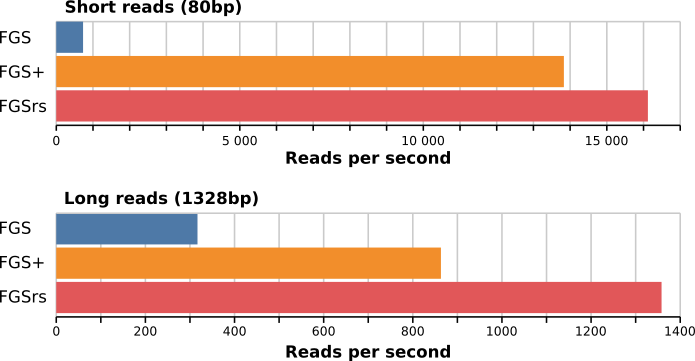
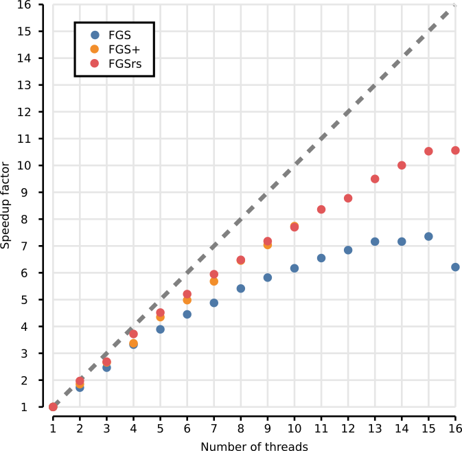

# FragGeneScanRs

## Installation

### From release

Download the build of the [latest release][release] for your platform
and extract it somewhere in your path.

[release]: https://github.com/unipept/FragGeneScanRs/releases/latest

### From source

FragGeneScanRs is written in Rust, so first head over to their
[installation instructions][Rust]. Afterwards, clone this repository or
download the source code of the [latest release][release]. In this
directory, run `cargo install --path .` to install. The installation
progress may prompt you to add a directory to your path so you can
easily execute it.

[Rust]: https://www.rust-lang.org/tools/install

## Usage

You can use FragGeneScanRs with the short options of FragGeneScan but
it also provides long-form options and some additional options. It
reads from standard input and writes to and standard output by default,
allowing shorter calls in case you only need the predicted proteins.

```sh
# get predictions for 454 pyrosequencing reads with about 1% error rate
FragGeneScanRs -t 454_10 < example/NC_000913-454.fna > example/NC_000913-454.faa

# get predictions for complete reads
FragGeneScanRs -t complete -w 1 < example/NC_000913.fna > example/NC_000913.faa
```

### Backwards compatible mode

```sh
FragGeneScanRs -s seq_file_name -o output_file_name -w [0 or 1] -t train_file_name -p num_threads
```

where:

* `seq_file_name` is the absolute path for the FASTA file containing DNA
  sequences that need to undergo gene prediction

* `output_file_name` is the absolute path and prefix for the three
  output files. Files with extensions `.out`, `.faa` and `.ffn` will be
  created, respectively containing the gene prediction metadata, protein
  translations of predicted genes, and the DNA sequences of predicted
  genes.

* `0 or 1` for short sequence reads or complete genomic sequences.

* `train_file_name` is used to select the training file for one of the following types:

  - `complete` for complete genomic sequences or short sequence reads without sequencing error
  - `sanger_5` for Sanger sequencing reads with about 0.5% error rate
  - `sanger_10` for Sanger sequencing reads with about 1% error rate
  - `454_5` for 454 pyrosequencing reads with about 0.5% error rate
  - `454_10` for 454 pyrosequencing reads with about 1% error rate
  - `454_30` for 454 pyrosequencing reads with about 3% error rate
  - `illumina_5` for Illumina sequencing reads with about 0.5% error rate
  - `illumina_10` for Illumina sequencing reads with about 1% error rate

  The corresponding file should be in the subdirectory `train` of the
  working directory. Other files can be added and selected here.

* `num_threads` is the number of threads to be used. Defaults to 1.

### Additional options

* `-m meta_file`, `-n nucleotide_file` and `-a aa_file` can be used to
  write output to specific files, instead of having the program create
  filenames with predetermined extentions. These take precedence over
  the `-o` option.

* Leaving out the `-o` option or using the name `stdout` causes
  FragGeneScanRs to only write the predicted proteins to standard output.
  The other files can still be requested with the specific options above.

* Leaving out the `-s` options causes FragGeneScanRs to read sequences
  from standard input.

* `-r train_file_dir` allows to explicitly specify the pathname of
  the directory containing the training files, so you can execute the
  command anywhere on your system.

* The option `-u` can be used for some additional speed and reduced
  memory when using multithreading. The output will no longer be in the
  same order as the input (as in FGS and FGS+).

The complete list of options will be printed when running
`FragGeneScanRs --help`.

## Execution time

Benchmarks were done using the `meta/benchmark.sh` script on a 16-core
Intel(R) Xeon(R) CPU E5-2650 v2 @ 2.60GHz with 195GB RAM. The datasets
used are the example datasets provided by FragGeneScan. The table
below shows the average execution time of 5 runs. Detailed results
may be found in `meta/benchmark.csv`. For the short reads (80bp),
FragGeneScanRs is about 22 times faster than FragGeneScan and 1.2
times as fast as FragGeneScanPlus. For the long reads (1328bp) and the
complete genome (Escherichia coli str. K-12 substr. MG1655, 4639675bp),
FragGeneScanRs is 4.3 and 2.2 times faster than FragGeneScan and 1.6 and
233.6 times faster than FGS+.





| Short reads      |  1 thread | 2 threads | 4 threads | 8 threads | 16 threads |
|:-----------------|----------:|----------:|----------:|----------:|-----------:|
| FragGeneScan     | 731 r/s | 1257 r/s | 2158 r/s | 3408 r/s | 3371 r/s |
| FragGeneScanPlus | 13830 r/s | 23997 r/s | 37882 r/s | 54610 r/s | / |
| FragGeneScanRs   | 16119 r/s | 29326 r/s | 48593 r/s | 73965 r/s | 99885 r/s |

| Long reads       |  1 thread | 2 threads | 4 threads | 8 threads | 16 threads |
|:-----------------|----------:|----------:|----------:|----------:|-----------:|
| FragGeneScan     | 317 r/s | 545 r/s | 1053 r/s | 1715 r/s | 1968 r/s |
| FragGeneScanPlus | 863 r/s | 1596 r/s | 2910 r/s | 5573 r/s | / |
| FragGeneScanRs   | 1358 r/s | 2674 r/s | 5051 r/s | 8803 r/s | 14343 r/s |

| Complete genome  |  1 thread |
|:-----------------|----------:|
| FragGeneScan     | 6.668 s |
| FragGeneScanPlus | 712.265 s |
| FragGeneScanRs   | 3.049 s |


The commands and arguments used for this benchmarks were:

```sh
./FragGeneScan -t 454_10 -s example/NC_000913-454.fna -o example/NC_000913-454 -w 0
./FGS+ -t 454_10 -s example/NC_000913-454.fna -o example/NC_000913-454 -w 0
./FragGeneScanRs -t 454_10 -s example/NC_000913-454.fna -o example/NC_000913-454 -w 0

./FragGeneScan -t complete -s example/contigs.fna -o example/contigs -w 1
./FGS+ -t complete -s example/contigs.fna -o example/contigs -w 1
./FragGeneScanRs -t complete -s example/contigs.fna -o example/contigs -w 1

./FragGeneScan -t complete -s example/NC_000913.fna -o example/NC_000913 -w 1
./FGS+ -t complete -s example/NC_000913.fna -o example/NC_000913 -w 1
./FragGeneScanRs -t complete -s example/NC_000913.fna -o example/NC_000913 -w 1
```

By default, FragGeneScanPlus outputs only the predicted genes, not the
metadata and DNA files. Below are measurements taken when those files
aren't generated by FragGeneScanRs either.

| Short reads      |  1 thread | 2 threads | 4 threads | 8 threads |
|:-----------------|----------:|----------:|----------:|----------:|
| FragGeneScanPlus | 13765 r/s | 24500 r/s | 39548 r/s | 57147 r/s |
| FragGeneScanRs   | 16815 r/s | 28784 r/s | 50157 r/s | 75397 r/s |

The commands used here are:

```sh
./FGS+ -t 454_10 -s example/NC_000913-454.fna -o stdout -w 0 > /dev/null
./FragGeneScanRs -t 454_10 -s example/NC_000913-454.fna -o stdout -w 0 > /dev/null
```

## Memory usage

The figure below shows the memory footprint for multithreaded execution
of FGS, FGS+ and FGSrs on long reads (1328 bp). Total memory footprint
(heap, stack and memory-mapped file I/O) is measured using the Massif
heap profiler of Valgrind with the `--pages-as-heap` option. Race
conditions consistently halt the execution of FGS+ above 10 threads. FGS
and FGSrs generate DNA sequences, protein translations and metadata,
whereas FGS+ only generates protein translations because the software
crashes when other output is generated. FGS and FGS+ report gene
predictions out-of-order, where default in-order reporting was used for
FGSrs.


